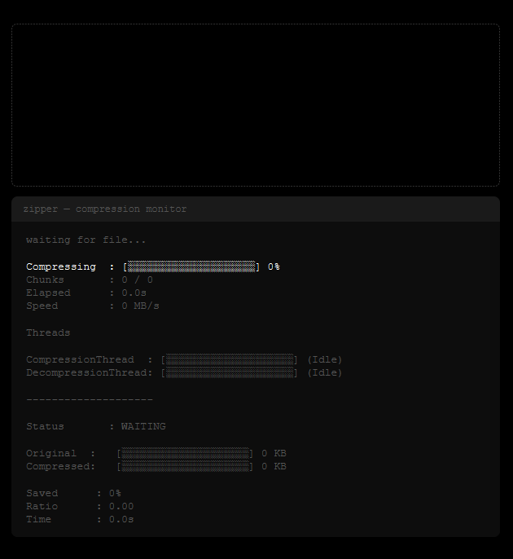

# Zipper
Zipper is a small JavaFX-based utility for compressing and decompressing files and folders. It offers a simple drag-and-drop UI that:

- Compresses regular files to GZip (.gz) using chunked parallel compression.
- Decompresses .gz files and reassembles chunked archives.
- Creates / extracts ZIP archives for directories.
- Shows realtime progress, throughput, and summary statistics in a terminal-like UI.

**Contents**

- `main/src/main/java/zipper` — application source (UI, compressors, reassembly logic).
- `main/src/main/resources/zipper` — UI assets (`UI.fxml`, `UI.css`).

**Requirements**

- Java 11 (OpenJDK or Oracle JDK).
- Maven (build and run via the included `pom.xml`).
- Internet access to download JavaFX dependencies (the project uses OpenJFX 13).

**Build & Run**

From the project root run the JavaFX Maven plugin (recommended):

```bash
mvn clean javafx:run -f main/pom.xml
```

This uses the `javafx-maven-plugin` configured in `main/pom.xml` and will launch the GUI.

You can also open the `main` folder as a Maven project in your IDE and run `zipper.App`.

Note: packaging a self-contained executable JAR with JavaFX requires additional config (jlink/jpackage or shading). If you want a packaged native distribution, tell me and I can add instructions or configure the pom.

**Using the App**

1. Launch the app (see Build & Run above).
2. Drag a file or directory onto the large drop area.

- If you drop a regular file it will be compressed to a `.gz` file.
- If you drop a file ending with `.gz` the app will attempt to decompress it (reassemble chunked archives when present).
- If you drop a directory it will be archived to a `.zip` file.
- If you drop a `.zip` file it will be unzipped to a directory.

The application writes outputs to a writable output directory. By default it attempts several candidate locations (in order):

- `%USERPROFILE%\Downloads\zipper-output` (Windows)
- `$HOME/Downloads/zipper-output` (macOS/Linux)
- the system temporary directory (a `zipper-output` subfolder)

If none of those locations are writable the app will report an error in the UI. You can change this behavior by editing the `FileReader.getWritableOutputDir()` method.

**Progress & Status**

The UI shows a terminal-style progress panel with:

- current command (shown as a faux `zipper` command)
- percent complete and a progress bar
- chunk counts and elapsed time
- throughput (MB/s), compression ratio and space saved
- thread status for compression / decompression
 - thread status for compression / decompression

**Example Screenshot**

Below is an example screenshot of the app's UI. 



**Files of interest**

- `App.java` — JavaFX entry point.
- `UIController.java` — updates the UI and handles progress callbacks.
- `FileReader.java` — drag/drop handling and high-level dispatch for compress/uncompress/zip/unzip.
- `Chunk.java` — chunked compression driver used to produce `.gz` outputs.
- `Reassemble.java` — reassembles chunked archives and performs decompression.
- `GZipCompressor.java`, `GZipDecompressor.java` — gzip implementation.
- `ZipUtil.java` — helpers to zip/unzip directories.
- `Statistics.java` — runtime statistics used to update the UI.

**Troubleshooting**

- If the app fails to start, ensure `JAVA_HOME` points to a Java 11 JDK and `mvn` is on your `PATH`.
- If JavaFX classes are not found, confirm Maven downloaded the `org.openjfx` dependencies; rerun `mvn clean javafx:run -f main/pom.xml`.
- If output files are not created, check the UI failure message (it will show "No writable output directory found" if the default candidates are not writable).

**Development**

- Open the `main` folder as a Maven project in your IDE (IntelliJ IDEA, Eclipse, VS Code with Java extensions).
- Run `App.java` or use `mvn javafx:run -f main/pom.xml`.

**License & Contributions**

This repo does not include a license file. If you plan to share or accept contributions, add a `LICENSE` and update this README accordingly.

